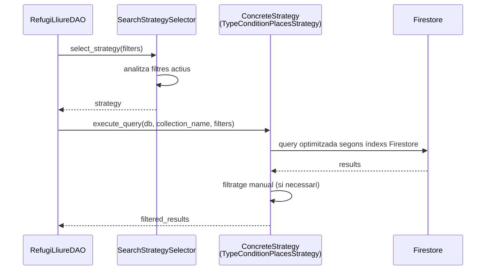
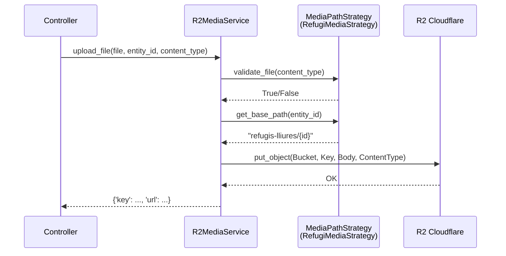
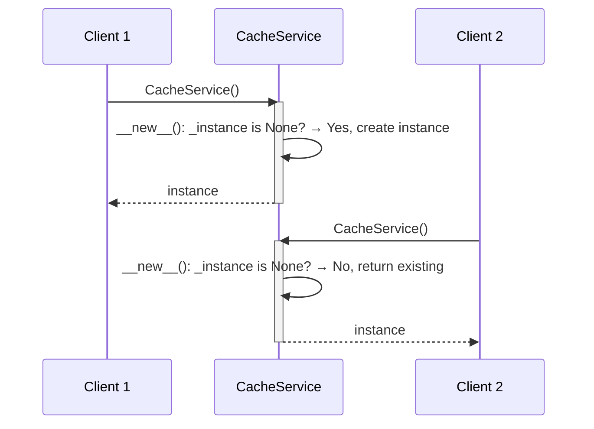
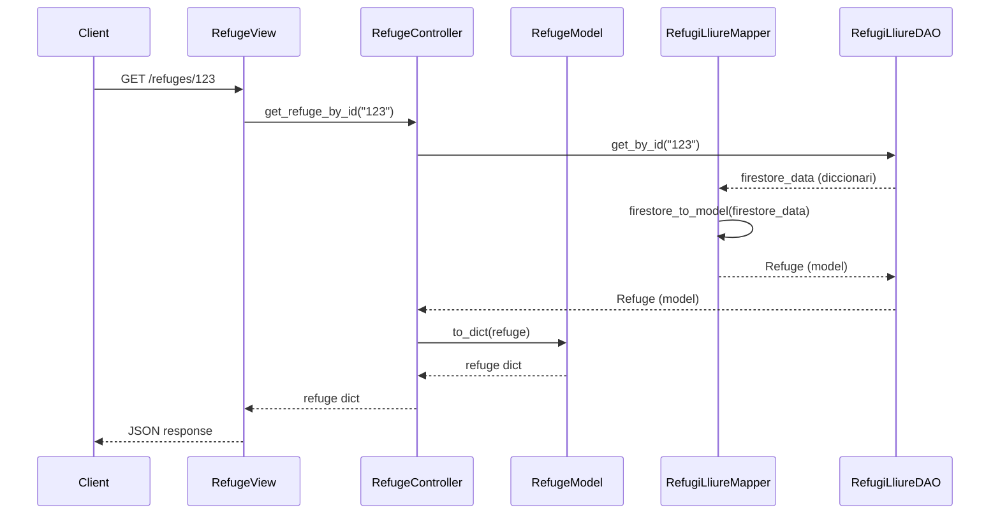
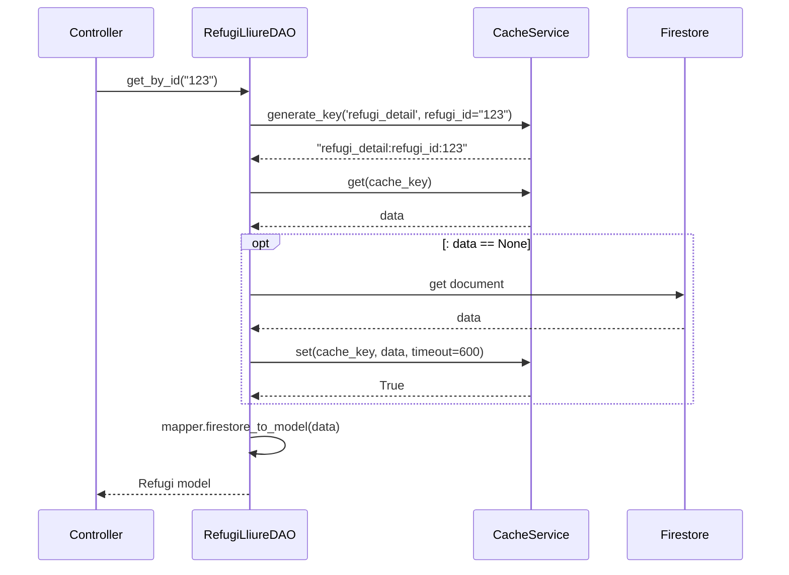
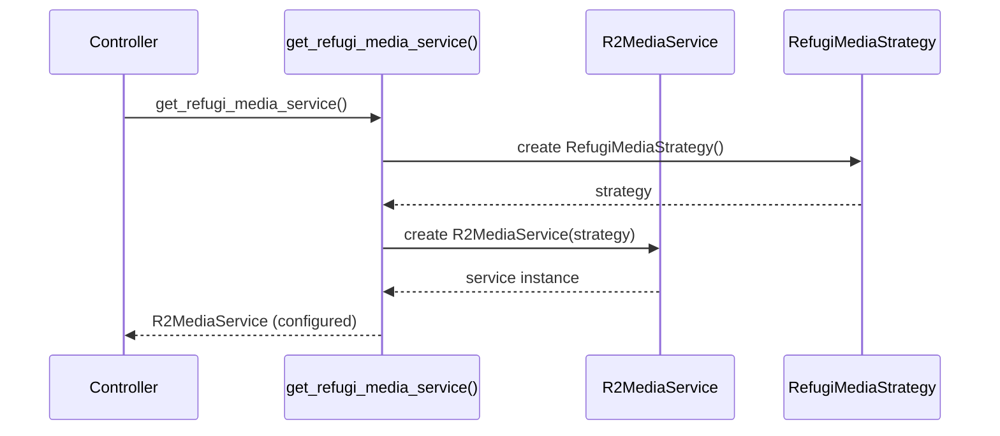
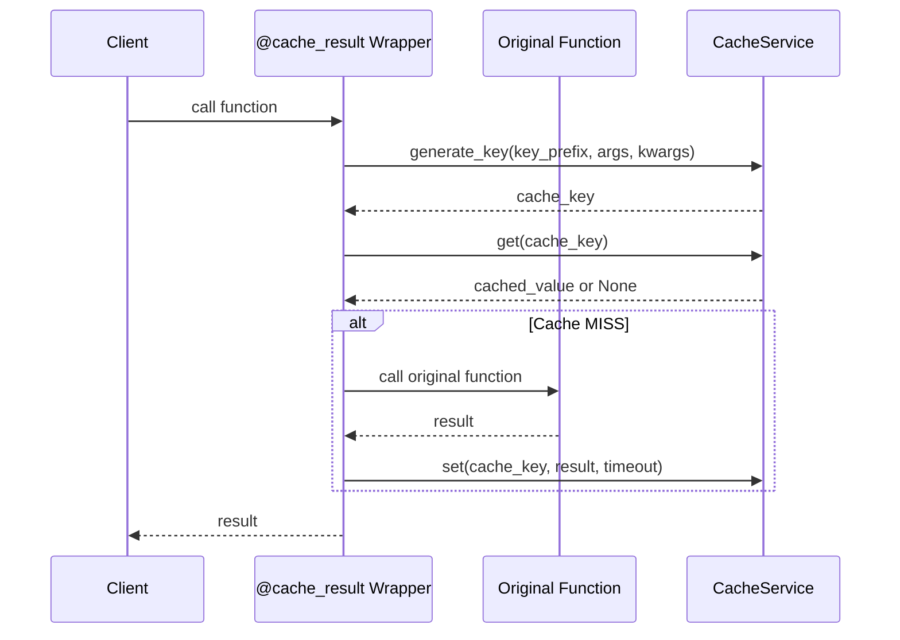
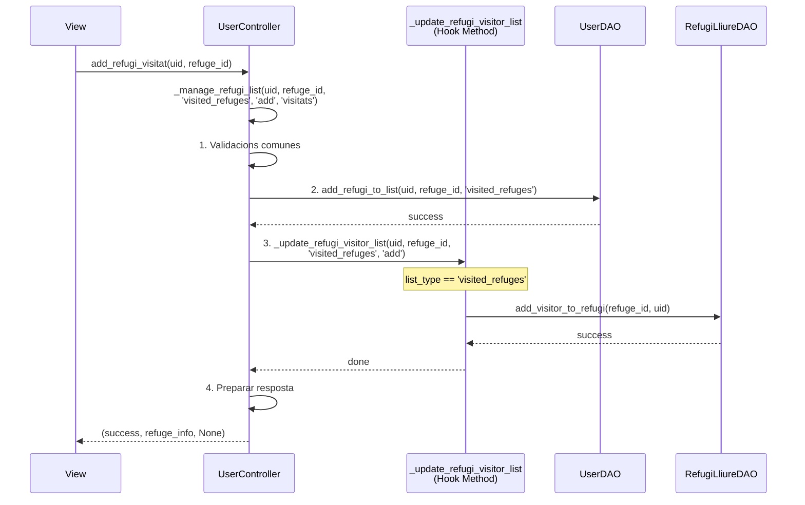
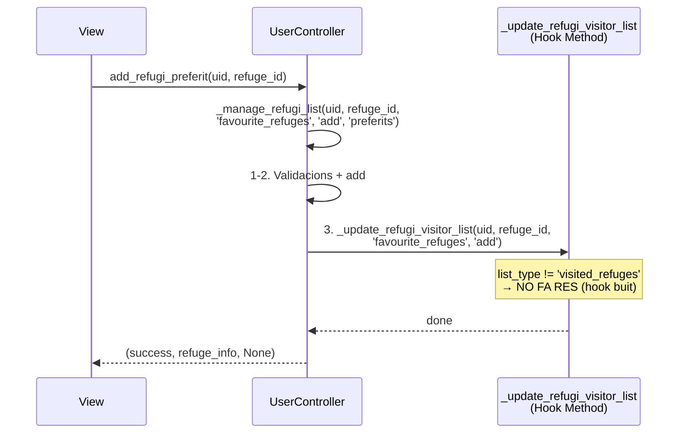
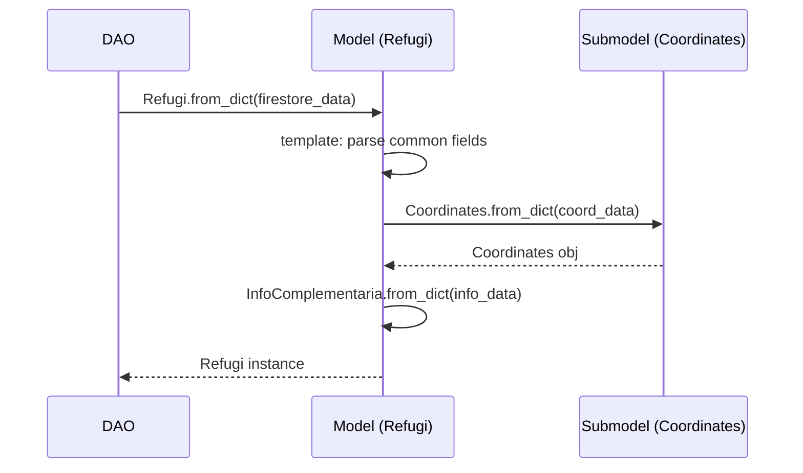

# Patrons Arquitectònics i de Disseny - RefugisLliures Backend

Aquest document descriu els patrons arquitectònics i de disseny utilitzats al projecte RefugisLliures Backend, proporcionant una visió general de l'arquitectura del sistema i els patrons aplicats per garantir un codi mantenible, escalable i testejable.

---

## Índex

1. [Patrons Arquitectònics](#patrons-arquitectònics)
   - [Arquitectura en Capes (Layered Architecture)](#1-arquitectura-en-capes-layered-architecture)
   - [REST API](#2-rest-api)
   - [Middleware Pipeline](#3-middleware-pipeline)

2. [Patrons de Disseny](#patrons-de-disseny)
   - [Strategy Pattern](#1-strategy-pattern)
   - [Singleton Pattern](#2-singleton-pattern)
   - [Data Transfer Object (DTO) / Data Mapper Pattern](#3-data-transfer-object-dto--data-mapper-pattern)
   - [Data Access Object (DAO) Pattern](#4-data-access-object-dao-pattern)
   - [Factory Pattern](#5-factory-pattern)
   - [Decorator Pattern](#6-decorator-pattern)
   - [Template Method Pattern](#7-template-method-pattern)

---

## Patrons Arquitectònics

### 1. Arquitectura en Capes (Layered Architecture)

**Descripció:**  
El projecte segueix una arquitectura en capes ben definida que separa les responsabilitats en diferents nivells, facilitant el manteniment, testing i escalabilitat del sistema.

**Capes identificades:**

| Capa | Directori | Responsabilitat |
|------|-----------|-----------------|
| **Presentació (Views)** | `api/views/` | Rep les peticions HTTP, valida l'entrada i retorna les respostes |
| **Lògica de Negoci (Controllers)** | `api/controllers/` | Conté la lògica de negoci i coordina les operacions |
| **Accés a Dades (DAOs)** | `api/daos/` | Gestiona l'accés a Firestore i la persistència de dades |
| **Serveis** | `api/services/` | Serveis transversals (cache, media, Firestore) |
| **Models** | `api/models/` | Defineix les entitats del domini |
| **Mappers** | `api/mappers/` | Transforma dades entre capes |
| **Serializers** | `api/serializers/` | Serialització/Deserialització de dades per l'API |

**On s'utilitza:**  
Tot el projecte segueix aquesta estructura. Cada entitat (Refugi, User, Experience, Doubt, Renovation, etc.) té els seus fitxers corresponents a cada capa.

**Diagrama d'arquitectura:**

```
┌─────────────────────────────────────────────────────────────────────┐
│                         CLIENT (Mobile App)                          │
└─────────────────────────────────────────────────────────────────────┘
                                    │
                                    ▼
┌─────────────────────────────────────────────────────────────────────┐
│                      MIDDLEWARE (Firebase Auth)                       │
│                   firebase_auth_middleware.py                         │
└─────────────────────────────────────────────────────────────────────┘
                                    │
                                    ▼
┌─────────────────────────────────────────────────────────────────────┐
│                        VIEWS (Presentació)                           │
│   refugi_lliure_views.py │ user_views.py │ experience_views.py       │
└─────────────────────────────────────────────────────────────────────┘
                                    │
                                    ▼
┌─────────────────────────────────────────────────────────────────────┐
│                     CONTROLLERS (Lògica de Negoci)                   │
│   refugi_lliure_controller.py │ user_controller.py │ ...            │
└─────────────────────────────────────────────────────────────────────┘
                                    │
                    ┌───────────────┼───────────────┐
                    ▼               ▼               ▼
┌──────────────────────┐  ┌──────────────┐  ┌──────────────────────┐
│        DAOs          │  │   MAPPERS    │  │      SERVICES        │
│ refugi_lliure_dao.py │  │ *_mapper.py  │  │  cache_service.py    │
│ user_dao.py          │  │              │  │  r2_media_service.py │
└──────────────────────┘  └──────────────┘  │  firestore_service.py│
          │                                  └──────────────────────┘
          ▼                                           │
┌─────────────────────────────────────────────────────────────────────┐
│                      EXTERNAL SERVICES                               │
│         Firestore (NoSQL DB)  │  R2 Cloudflare  │  Redis Cache      │
└─────────────────────────────────────────────────────────────────────┘
```

---

### 2. REST API

**Descripció:**  
L'API segueix els principis RESTful amb endpoints clarament definits que segueixen les convencions HTTP estàndard.

**Característiques implementades:**
- Ús correcte dels mètodes HTTP (GET, POST, PATCH, DELETE)
- URLs basades en recursos (`/refuges/`, `/users/`, `/experiences/`)
- Respostes amb codis HTTP estàndard (200, 201, 400, 401, 403, 404, 500)
- Documentació amb Swagger/OpenAPI

**On s'utilitza:**  
- `api/urls.py` - Definició de rutes
- `api/views/*.py` - Implementació dels endpoints

**Exemple d'estructura REST:**
```
GET    /api/refuges/              → Llistar refugis
GET    /api/refuges/{id}/         → Obtenir refugi específic
POST   /api/refuges/{id}/media/   → Pujar mitjans al refugi
DELETE /api/refuges/{id}/media/{key}/ → Eliminar mitjà
```

---

### 3. Middleware Pipeline

**Descripció:**  
Implementació del patró Pipeline mitjançant middleware de Django per processar les peticions abans d'arribar a les views.

**On s'utilitza:**  
- `api/middleware/firebase_auth_middleware.py`

**Responsabilitats:**
- Interceptar peticions HTTP
- Validar tokens JWT de Firebase
- Injectar informació d'usuari a la request
- Retornar errors d'autenticació quan cal

---

## Patrons de Disseny

### 1. Strategy Pattern

**Descripció:**  
El patró Strategy permet definir una família d'algorismes, encapsular-los i fer-los intercanviables. S'utilitza extensament al projecte per gestionar diferents estratègies de cerca i tipus de mitjans.

**On s'utilitza:**

#### 1.1 Estratègies de Cerca de Refugis
- **Fitxers:** `api/daos/search_strategies.py`
- **Classes:**
  - `RefugiSearchStrategy` (Interfície abstracta)
  - `TypeConditionStrategy`
  - `TypeConditionPlacesStrategy`
  - `TypeConditionAltitudeStrategy`
  - `TypePlacesStrategy`
  - `ConditionPlacesStrategy`
  - `PlacesOnlyStrategy`
  - `AltitudeOnlyStrategy`
  - ... (18+ estratègies)
- **Selector:** `SearchStrategySelector`

#### 1.2 Estratègies de Gestió de Mitjans
- **Fitxers:** `api/services/r2_media_service.py`
- **Classes:**
  - `MediaPathStrategy` (Interfície abstracta)
  - `RefugiMediaStrategy` (per imatges/vídeos de refugis)
  - `UserAvatarStrategy` (per avatars d'usuaris)

**Diagrama de Seqüència - Strategy de Cerca:**



**Diagrama de Seqüència - Strategy de Mitjans:**



---

### 2. Singleton Pattern

**Descripció:**  
El patró Singleton assegura que una classe només tingui una instància i proporciona un punt d'accés global a aquesta instància.

**On s'utilitza:**

| Classe | Fitxer | Propòsit |
|--------|--------|----------|
| `CacheService` | `api/services/cache_service.py` | Gestió centralitzada de la cache Redis |
| `FirestoreService` | `api/services/firestore_service.py` | Connexió única a Firestore |

**Implementació (CacheService):**
```python
class CacheService:
    _instance = None
    
    def __new__(cls):
        if cls._instance is None:
            cls._instance = super(CacheService, cls).__new__(cls)
        return cls._instance
```

**Diagrama de Seqüència - Singleton:**



---

### 3. Data Transfer Object (DTO) / Data Mapper Pattern

**Descripció:**  
El patró DTO/Mapper s'utilitza per transferir dades entre capes i transformar entre diferents representacions de les dades.

**On s'utilitza:**

| Mapper | Fitxer | Transformacions |
|--------|--------|-----------------|
| `RefugiLliureMapper` | `api/mappers/refugi_lliure_mapper.py` | Firestore ↔ Model Refugi ↔ Response |
| `UserMapper` | `api/mappers/user_mapper.py` | Firestore ↔ Model User |
| `ExperienceMapper` | `api/mappers/experience_mapper.py` | Firestore ↔ Model Experience |
| `DoubtMapper` | `api/mappers/doubt_mapper.py` | Firestore ↔ Model Doubt |
| `RenovationMapper` | `api/mappers/renovation_mapper.py` | Firestore ↔ Model Renovation |
| `RefugeProposalMapper` | `api/mappers/refuge_proposal_mapper.py` | Firestore ↔ Model Proposal |
| `RefugeVisitMapper` | `api/mappers/refuge_visit_mapper.py` | Firestore ↔ Model Visit |

**Diagrama de Seqüència - Mapper:**



---

### 4. Data Access Object (DAO) Pattern

**Descripció:**  
El patró DAO encapsula l'accés a la base de dades, aïllant la lògica de negoci dels detalls d'implementació de l'emmagatzematge.

**On s'utilitza:**

| DAO | Fitxer | Entitat |
|-----|--------|---------|
| `RefugiLliureDAO` | `api/daos/refugi_lliure_dao.py` | Refugis |
| `UserDAO` | `api/daos/user_dao.py` | Usuaris |
| `ExperienceDAO` | `api/daos/experience_dao.py` | Experiències |
| `DoubtDAO` | `api/daos/doubt_dao.py` | Dubtes |
| `RenovationDAO` | `api/daos/renovation_dao.py` | Renovacions |
| `RefugeProposalDAO` | `api/daos/refuge_proposal_dao.py` | Propostes de refugis |
| `RefugeVisitDAO` | `api/daos/refuge_visit_dao.py` | Visites a refugis |

**Responsabilitats del DAO:**
- Operacions CRUD (Create, Read, Update, Delete)
- Gestió de cache integrada
- Construcció de queries optimitzades
- Conversió de dades Firestore a models

**Diagrama de Seqüència - DAO amb Cache:**



---

### 5. Factory Pattern

**Descripció:**  
El patró Factory proporciona una interfície per crear objectes sense especificar les seves classes concretes.

**On s'utilitza:**

- **Fitxer:** `api/services/r2_media_service.py`
- **Funcions Factory:**
  - `get_refugi_media_service()` → Retorna `R2MediaService(RefugiMediaStrategy())`
  - `get_user_avatar_service()` → Retorna `R2MediaService(UserAvatarStrategy())`

**Implementació:**
```python
def get_refugi_media_service() -> R2MediaService:
    """Retorna una instància del servei configurada per a mitjans de refugis."""
    return R2MediaService(RefugiMediaStrategy())

def get_user_avatar_service() -> R2MediaService:
    """Retorna una instància del servei configurada per a avatars d'usuaris."""
    return R2MediaService(UserAvatarStrategy())
```

**Diagrama de Seqüència - Factory:**



---

### 6. Decorator Pattern

**Descripció:**  
El patró Decorator permet afegir funcionalitat a objectes de forma dinàmica sense modificar la seva estructura.

**On s'utilitza:**

#### 6.1 Decorador de Cache
- **Fitxer:** `api/services/cache_service.py`
- **Decorador:** `@cache_result`

**Implementació:**
```python
def cache_result(key_prefix: str, timeout: Optional[int] = None):
    """
    Decorador per fer cache automàtic del resultat d'una funció
    """
    def decorator(func: Callable) -> Callable:
        @wraps(func)
        def wrapper(*args, **kwargs):
            cache_key = cache_service.generate_key(key_prefix, args=args, kwargs=kwargs)
            cached_value = cache_service.get(cache_key)
            if cached_value is not None:
                return cached_value
            result = func(*args, **kwargs)
            cache_service.set(cache_key, result, actual_timeout)
            return result
        return wrapper
    return decorator
```

#### 6.2 Decoradors de Django REST Framework
- **Fitxers:** `api/views/*.py`
- **Decoradors:**
  - `@swagger_auto_schema` - Documentació automàtica d'endpoints
  - `@api_view` - Definir mètodes HTTP permesos

**Diagrama de Seqüència - Decorator Cache:**



---

### 7. Template Method Pattern amb Hook Methods

**Descripció:**  
El patró Template Method defineix l'esquelet d'un algorisme en una operació, diferint alguns passos a les subclasses o mètodes hook. Els **Hook Methods** són mètodes opcionals que permeten estendre el comportament del template sense modificar-lo.

**On s'utilitza:**

#### 7.1 Gestió de Llistes de Refugis (Preferits/Visitats)
- **Fitxer:** `api/controllers/user_controller.py`
- **Mètode Template:** `_manage_refugi_list()` - Defineix l'esquelet de l'algorisme per gestionar refugis en llistes
- **Hook Method:** `_update_refugi_visitor_list()` - Executa lògica addicional només per a refugis visitats
- **Mètode Template:** `_get_refugis_info_by_type()` - Obté informació de refugis segons el tipus de llista

**Estructura del Template Method:**
```python
def _manage_refugi_list(self, uid, refuge_id, list_type, operation, operation_name):
    # 1. Validacions comunes (invariant)
    # 2. Operació sobre la llista de l'usuari
    # 3. Hook: operació específica al refugi (només per visitats)
    self._update_refugi_visitor_list(uid, refuge_id, list_type, operation)
    # 4. Preparar resposta
```

**Mètodes públics que utilitzen el Template:**
- `add_refugi_preferit()` → crida `_manage_refugi_list(..., 'favourite_refuges', 'add', ...)`
- `remove_refugi_preferit()` → crida `_manage_refugi_list(..., 'favourite_refuges', 'remove', ...)`
- `add_refugi_visitat()` → crida `_manage_refugi_list(..., 'visited_refuges', 'add', ...)`
- `remove_refugi_visitat()` → crida `_manage_refugi_list(..., 'visited_refuges', 'remove', ...)`

**Diagrama de Seqüència - Template Method amb Hook (Visitats):**



**Diagrama de Seqüència - Preferits (Hook NO s'executa):**



#### 7.2 Models amb mètodes `to_dict()` i `from_dict()`
- **Fitxers:** `api/models/*.py`
- **Classes:** `Refugi`, `User`, `Experience`, `Doubt`, `Renovation`, `MediaMetadata`, etc.

Cada model implementa els mètodes estàndard de serialització/deserialització:
- `to_dict()` - Converteix el model a diccionari
- `from_dict(cls, data)` - Crea una instància del model des d'un diccionari

#### 7.3 Estratègies de Cerca
- **Fitxer:** `api/daos/search_strategies.py`
- **Classe base:** `RefugiSearchStrategy` (abstracta)
- **Mètodes plantilla:**
  - `execute_query()` (abstracte, implementat per cada estratègia)
  - `get_strategy_name()` (abstracte, implementat per cada estratègia)

**Diagrama de Seqüència - Template Method (Models):**



---

## Resum de Patrons

### Patrons Arquitectònics

| Patró | Descripció | Beneficis |
|-------|------------|-----------|
| **Layered Architecture** | Separació en capes (Views, Controllers, DAOs, Services) | Mantenibilitat, testabilitat, separació de responsabilitats |
| **REST API** | Interfície HTTP estàndard amb recursos i mètodes HTTP | Interoperabilitat, escalabilitat, documentació clara |
| **Middleware Pipeline** | Processament de peticions abans d'arribar a les views | Autenticació centralitzada, logging, validació |

### Patrons de Disseny

| Patró | Fitxers Principals | Propòsit |
|-------|-------------------|----------|
| **Strategy** | `search_strategies.py`, `r2_media_service.py` | Algorismes intercanviables per cerca i gestió de mitjans |
| **Singleton** | `cache_service.py`, `firestore_service.py` | Instàncies úniques de serveis |
| **DTO/Mapper** | `api/mappers/*.py` | Transformació de dades entre capes |
| **DAO** | `api/daos/*.py` | Encapsulació d'accés a dades |
| **Factory** | `r2_media_service.py` | Creació d'objectes configurats |
| **Decorator** | `cache_service.py`, views | Funcionalitat addicional sense modificar classes |
| **Template Method + Hook** | `user_controller.py`, `api/models/*.py`, `search_strategies.py` | Esquelet d'algorismes amb passos personalitzables i hooks opcionals |

---

## Diagrama General de Flux

```
┌─────────────────────────────────────────────────────────────────────────────────────────┐
│                                    CLIENT REQUEST                                        │
└─────────────────────────────────────────────────────────────────────────────────────────┘
                                           │
                                           ▼
┌─────────────────────────────────────────────────────────────────────────────────────────┐
│                              MIDDLEWARE PIPELINE                                         │
│                     (FirebaseAuthenticationMiddleware)                                   │
│                          - Valida JWT Token                                              │
│                          - Injecta user info                                             │
└─────────────────────────────────────────────────────────────────────────────────────────┘
                                           │
                                           ▼
┌─────────────────────────────────────────────────────────────────────────────────────────┐
│                                    VIEW LAYER                                            │
│                              (APIView classes)                                           │
│                         @swagger_auto_schema decorator                                   │
│                         - Validació entrada (Serializers)                                │
│                         - Gestió permisos                                                │
└─────────────────────────────────────────────────────────────────────────────────────────┘
                                           │
                                           ▼
┌─────────────────────────────────────────────────────────────────────────────────────────┐
│                                 CONTROLLER LAYER                                         │
│                              (Business Logic)                                            │
│                         - Orquestra operacions                                           │
│                         - Aplica regles de negoci                                        │
└─────────────────────────────────────────────────────────────────────────────────────────┘
                                           │
                    ┌──────────────────────┼──────────────────────┐
                    ▼                      ▼                      ▼
┌──────────────────────────┐  ┌───────────────────────┐  ┌────────────────────────┐
│        DAO LAYER         │  │     SERVICE LAYER     │  │     MAPPER LAYER       │
│  - CRUD operations       │  │  - CacheService       │  │  - Data transformation │
│  - Query building        │  │    (Singleton)        │  │  - Firestore ↔ Model   │
│  - Strategy Pattern      │  │  - R2MediaService     │  │                        │
│    for search            │  │    (Factory+Strategy) │  │                        │
└──────────────────────────┘  │  - FirestoreService   │  └────────────────────────┘
            │                 │    (Singleton)        │
            │                 └───────────────────────┘
            │                            │
            ▼                            ▼
┌─────────────────────────────────────────────────────────────────────────────────────────┐
│                                 EXTERNAL SERVICES                                        │
│              Firestore (NoSQL)  │  R2 Cloudflare  │  Redis Cache  │  Firebase Auth      │
└─────────────────────────────────────────────────────────────────────────────────────────┘
```

---

## Conclusions

El projecte RefugisLliures Backend implementa una arquitectura sòlida basada en patrons ben establerts que proporcionen:

1. **Mantenibilitat**: La separació en capes permet modificar una part del sistema sense afectar les altres.

2. **Testabilitat**: Els patrons com DAO i Strategy faciliten el testing unitari i d'integració.

3. **Escalabilitat**: L'ús de cache, estratègies optimitzades i serveis singleton permeten gestionar un volum creixent de peticions.

4. **Flexibilitat**: El patró Strategy permet afegir noves estratègies de cerca o tipus de mitjans sense modificar el codi existent.

5. **Reutilització**: Els mappers, serveis i decoradors són reutilitzables a través de diferents parts de l'aplicació.

---

*Document generat el 11 de gener de 2026*
