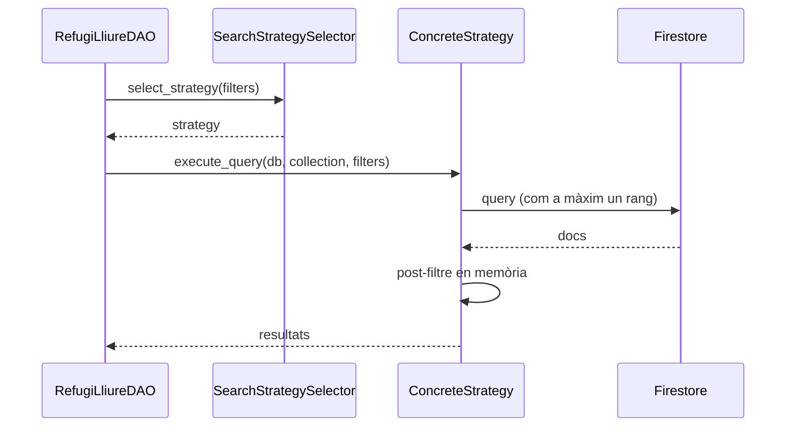
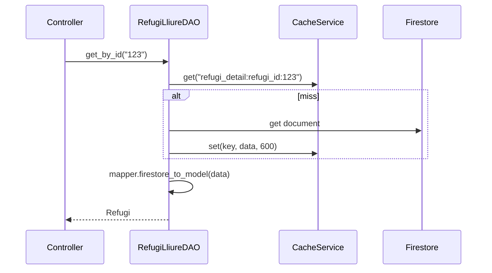

# Patrons arquitectònics i de disseny (detall)

> **[FET]** comprovat al codi · **[INFERÈNCIA]** deducció · **[NO VERIFICAT]** depèn de config externa.
> Resum en una taula: [ARCHITECTURE §3 i §7](../ARCHITECTURE.md). Aquest document amplia cada patró amb on viu, per què hi és i un diagrama.

## Arquitectònics

### 1. Arquitectura en capes
`View → Serializer → Controller → DAO → (CacheService, Firestore, R2)`, amb `Mapper` i `Model` transversals. Contractes de cada capa: [ARCHITECTURE §3](../ARCHITECTURE.md). Cada domini (refugi, user, experience, doubt, renovation, proposal, visit) té un fitxer per capa.

```
CLIENT (app mòbil)
   │
MIDDLEWARE  firebase_auth_middleware.py  (verifica JWT, injecta user_uid/user_claims)
   │
VIEWS       api/views/*_views.py  (APIView + @swagger_auto_schema, serializers d'entrada, permisos)
   │
CONTROLLERS api/controllers/*_controller.py  (regles de negoci, propietat, tuples (ok, data, error))
   │
   ├── DAOs     api/daos/*_dao.py  (Firestore + cache; Strategy de cerca)
   ├── MAPPERS  api/mappers/*_mapper.py
   └── SERVICES cache_service (Singleton) · firestore_service (Singleton) · r2_media_service (Strategy+Factory) · condition_service
   │
EXTERNS     Firestore · Cloudflare R2 · Redis · Firebase Auth
```
Excepcions al patró (lògica dins DAOs, permisos que accedeixen a Firestore…): [ARCHITECTURE §9](../ARCHITECTURE.md).

### 2. REST
Recursos a `api/urls.py` (`/refuges/`, `/users/`, `/experiences/`…), verbs GET/POST/PATCH/DELETE, Swagger a `/swagger/`. Hi ha desviacions de codis HTTP respecte a Swagger ([TECH_DEBT B8](../TECH_DEBT.md)).

### 3. Middleware pipeline
`FirebaseAuthenticationMiddleware` intercepta totes les peticions abans de DRF ([flux 0](../flows/00-auth-request-pipeline.md)). Per què conviu amb una classe d'autenticació DRF: [decisions.md](decisions.md#adr-2--middleware--classe-dautenticació-drf).

## De disseny

### Strategy
| On | Interfície | Concrets | Selector |
|---|---|---|---|
| Cerca de refugis — `api/daos/search_strategies.py` | `RefugiSearchStrategy` (`execute_query`, `get_strategy_name`) | 15 estratègies (`TypeConditionPlacesAltitude` … `AltitudeOnly`) | `SearchStrategySelector.select_strategy` |
| Paths de media — `api/services/r2_media_service.py` | `MediaPathStrategy` (`get_base_path`, `get_allowed_content_types`, `validate_file`, `generate_media_metadata_from_dict`) | `RefugiMediaStrategy`, `UserAvatarStrategy` | factories (vegeu Factory) |
| Aprovació de propostes — `api/daos/refuge_proposal_dao.py` | estratègia per acció | `Create/Update/DeleteRefugeStrategy` | `ProposalStrategySelector` |


Ordre de prioritat de les 15 estratègies: [flux 4](../flows/04-refuge-search-detail.md#estratègies-de-cerca-apidaossearch_strategiespy).

### Singleton
`CacheService` i `FirestoreService` amb `__new__` + instància global (`cache_service`, `firestore_service`). Compte: `CacheService.__init__` es re-executa a cada `CacheService()` ([recipes/add-service.md](../recipes/add-service.md)).

### DAO + Data Mapper
Un DAO i un mapper per entitat: `RefugiLliureDAO`, `UserDAO`, `ExperienceDAO`, `DoubtDAO`, `RenovationDAO`, `RefugeProposalDAO`, `RefugeVisitDAO`; mappers homònims a `api/mappers/`. El DAO integra la cache (get → miss → Firestore → set):


### Factory
- **Funcions factory** de R2: `get_refugi_media_service()` → `R2MediaService(RefugiMediaStrategy())`; `get_user_avatar_service()` → `R2MediaService(UserAvatarStrategy())`.
- **Factory method** als models: `@classmethod from_dict(cls, data)` crea instàncies sense que el client cridi el constructor i permet que una subclasse (p. ex. `RefugeMediaMetadata`) en creï de pròpies (`api/models/media_metadata.py`).

### Template Method (+ hook)
- `UserController._manage_refugi_list` defineix l'esquelet comú (validar usuari i refugi → operar sobre la llista → **hook** → resposta). El hook `_update_refugi_visitor_list` només actua per a `visited_refuges` (afegeix/treu l'UID de `visitors` del refugi); per a preferits no fa res. Ho usen `add/remove_refugi_preferit` i `add/remove_refugi_visitat` ([flux 10](../flows/10-favourite-visited.md)).
- `to_dict()` de `RefugeMediaMetadata` crida `super().to_dict()` i hi afegeix `creator_uid`/`experience_id`: la base dona la plantilla, la subclasse l'especialitza.

### Decorator
- `@swagger_auto_schema` a totes les vistes; `@api_view` + `@permission_classes` només a `cache_views.py`.
- `@cache_result` (`api/services/cache_service.py`) existeix però **no s'usa** fora de tests ([TECH_DEBT §Codi mort](../TECH_DEBT.md)).
