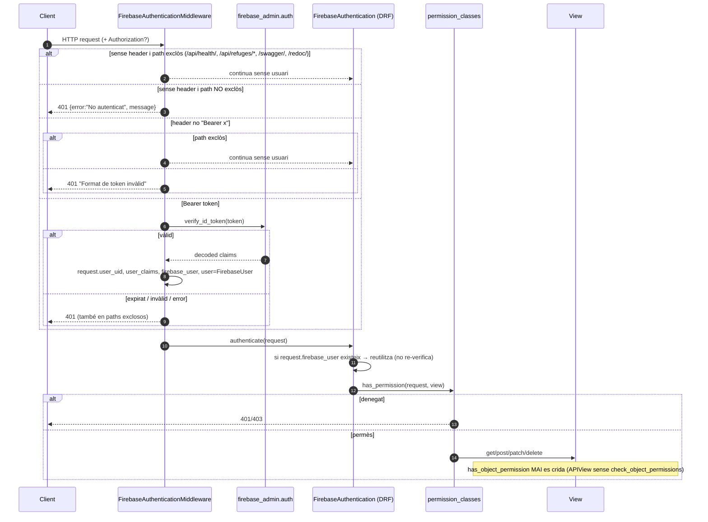

# Flux 0 — Pipeline d'autenticació d'una petició

> **[FET]** comprovat al codi · **[INFERÈNCIA]** deducció · **[NO VERIFICAT]** depèn de config externa.

Aplica a **totes** les peticions. El client obté un ID token de Firebase Auth i l'envia com `Authorization: Bearer <idToken>`.

## Peces
| Peça | Fitxer |
|---|---|
| Middleware Django | `api/middleware/firebase_auth_middleware.py` (registrat a `refugis_lliures/settings.py:74`) |
| Autenticació DRF | `api/authentication.py` (`REST_FRAMEWORK.DEFAULT_AUTHENTICATION_CLASSES`, `refugis_lliures/settings.py:158-160`) |
| Permisos | `api/permissions.py` + `rest_framework.permissions.IsAuthenticated` |
| Inicialització Firebase Admin | `api/apps.py:8-14` → `api/firebase_config.py:80-106` |

## Diagrama

## Passos
1. **Exclusió per prefix** — `EXCLUDED_PATHS` (`api/middleware/firebase_auth_middleware.py:20-25`) es compara amb `path.startswith` (`:98-103`). `/api/refuges/` inclou media, visits i renovations d'un refugi **[FET]**.
2. **Verificació** — `auth.verify_id_token(token)` (`:60`), sense `check_revoked` → `RevokedIdTokenError` (`:86`) no es pot donar **[INFERÈNCIA sobre l'SDK]**.
3. **Atributs a la request** (`:63-77`): `request.firebase_user` (claims), `request.user_uid`, `request.user_claims` (= tot el token decodificat, inclosos custom claims), `request.user` (objecte `FirebaseUser` amb `uid`, `claims`, `is_authenticated=True`).
4. **DRF** — `FirebaseAuthentication.authenticate` (`api/authentication.py:18-35`) reaprofita aquests atributs; si no hi són i hi ha header, verifica el token (`:38-70`).
5. **Permisos** — el default és `AllowAny` (`refugis_lliures/settings.py:161-163`). Els que realment actuen:
   - `IsAuthenticated` (DRF)
   - `IsSameUser` — `kwargs['uid'] == request.user.uid` (`api/permissions.py:50-72`)
   - `IsFirebaseAdmin` — `user_claims['role'] == 'admin'` (`:86-101`, helper `:10-21`)
   - `IsMediaUploader` — llegeix Firestore directament (`:192-276`)
6. **Inicialització de Firebase** — a `ApiConfig.ready()`; en tests (`pytest` importat o `TESTING=true`) no s'inicialitza (`api/firebase_config.py:15-17,92-94`).

## Errors
| Cas | Resposta |
|---|---|
| Sense token en ruta privada | 401 `{"error":"No autenticat","message":"Token d'autenticació no proporcionat"}` (`:45-46,105-110`) |
| Token expirat | 401 `"Token expirat"` (`:82-84`) |
| Token invàlid | 401 `"Token invàlid"` (`:90-92`) |
| Altre error | 401 amb el text de l'excepció (`:94-96`) |
| Permís denegat | 403 (DRF) |

## Guies
Com obtenir i enviar el token des del client, cURL o Swagger: [guides/client-auth-usage.md](../guides/client-auth-usage.md).

## Gotchas
- Un token caducat a `GET /api/refuges/` (públic) retorna **401** en lloc de servir la resposta anònima **[FET]**.
- `has_object_permission` no s'executa mai → vegeu [GOTCHAS.md](../GOTCHAS.md) #1.
- `request.user_uid` és la font de veritat de l'identitat a vistes i controllers; mai s'agafa l'UID del body.
