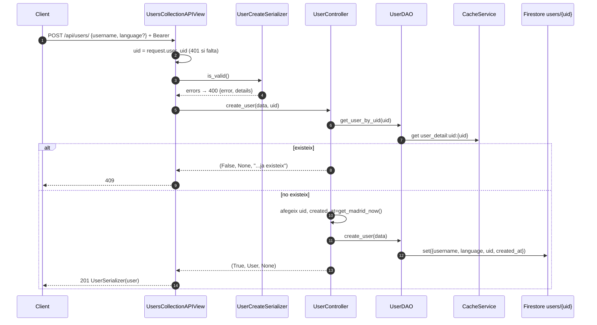
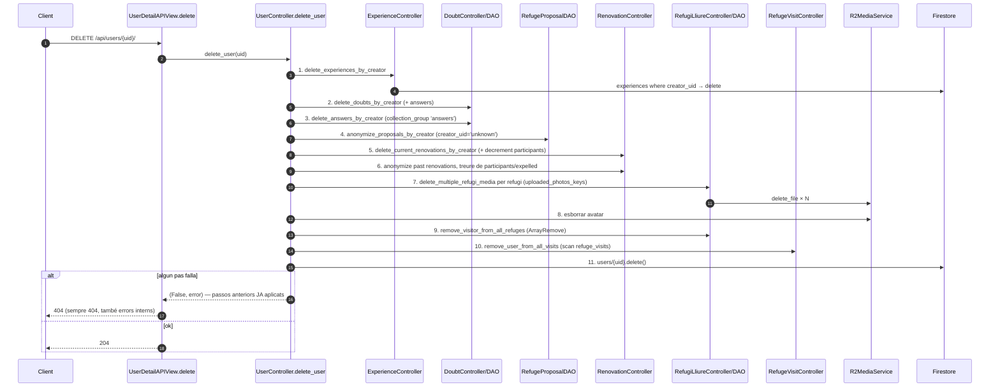

# Flux 1 — Perfil d'usuari (alta, consulta, edició, esborrat)

> **[FET]** comprovat al codi · **[INFERÈNCIA]** deducció · **[NO VERIFICAT]** depèn de config externa.

L'usuari es registra a **Firebase Auth des del client** (el backend no crea comptes d'Auth). Després el client crida `POST /api/users/` per crear el perfil a Firestore.

## Endpoints (`api/views/user_views.py`)
| Mètode | URL | Vista | Permisos |
|---|---|---|---|
| POST | `/api/users/` | `UsersCollectionAPIView.post` (L101) | IsAuthenticated (L74) |
| GET | `/api/users/{uid}/` | `UserDetailAPIView.get` (L175) | IsAuthenticated |
| PATCH | `/api/users/{uid}/` | `.patch` (L221) | IsAuthenticated + IsSameUser |
| DELETE | `/api/users/{uid}/` | `.delete` (L262) | IsAuthenticated + IsSameUser |

Col·lecció: **`users/{uid}`** (`api/daos/user_dao.py:19`). Model: `api/models/user.py:11-23` (camps: `uid, username, avatar_metadata, language='ca', favourite_refuges, visited_refuges, uploaded_photos_keys, num_shared_experiences, num_renovated_refuges, created_at`). A Firestore l'avatar es desa com a `media_metadata: {key, uploaded_at}` (sense URL); `to_dict()` retorna tant `media_metadata` com `avatar_metadata` (amb URL presignada) (`api/models/user.py:30-52`).

## Alta — diagrama

## Passos clau
- **Alta**: `UserCreateSerializer` (`api/serializers/user_serializer.py:131-143`) — `username` (≥2 caràcters), `language` ∈ `ca|es|en|fr` (default `ca`). `UserController.create_user` (`api/controllers/user_controller.py:29-62`) → `UserDAO.create_user` (`api/daos/user_dao.py:27-50`). Només es desen `username, language, uid, created_at` **[FET]**; comptadors i llistes s'afegeixen més tard amb `ArrayUnion`/`Increment`.
- **Consulta**: `UserDAO.get_user_by_uid` (`api/daos/user_dao.py:52-92`), cache `user_detail:uid:{uid}` (600 s). `User.from_dict` presigna l'avatar (`api/models/user.py:54-79`).
- **Edició**: `UserUpdateSerializer` (`api/serializers/user_serializer.py:145-163`) → `UserController.update_user` (`api/controllers/user_controller.py:88-123`) → `UserDAO.update_user` (`api/daos/user_dao.py:94-126`, `update()` + invalida `user_detail`). Fa 3 lectures (exists, update llegeix, re-get).

## Esborrat en cascada — diagrama

Detall de cada pas (`api/controllers/user_controller.py:125-276`). Criteri esborrar vs anonimitzar, abast complet, estratègia d'errors i com mantenir-ho: [deep-dives/user-deletion.md](../deep-dives/user-deletion.md).

| # | Acció | Codi |
|---|---|---|
| 1 | Esborra experiències (no les fotos: queden per al pas 7) | `api/daos/experience_dao.py:323-366` |
| 2 | Esborra dubtes de l'usuari i totes les seves respostes | `api/daos/doubt_dao.py:388-440` |
| 3 | Esborra respostes de l'usuari i recompta `answers_count` | `api/daos/doubt_dao.py:442-497` |
| 4 | Anonimitza propostes (`creator_uid='unknown'`) | `api/daos/refuge_proposal_dao.py:814-849` |
| 5 | Esborra renovations vigents creades per l'usuari; decrementa comptadors de participants | `api/daos/renovation_dao.py:509-562` |
| 6 | Anonimitza renovations passades (`creator_uid='unknown'`, `group_link=None`); `ArrayRemove` a `participants_uids` i `expelled_uids` | `api/daos/renovation_dao.py:564-696` |
| 7 | Esborra fotos pujades (R2 + `media_metadata` + `media_keys`) | `api/controllers/refugi_lliure_controller.py:296-370` |
| 8 | Esborra avatar | `api/controllers/user_controller.py:243-249` |
| 9 | Treu l'UID de `visitors` dels refugis visitats | `api/daos/refugi_lliure_dao.py:577-622` |
| 10 | Treu l'usuari de visites planificades | `api/controllers/refuge_visit_controller.py:314-340` |
| 11 | Esborra `users/{uid}` | `api/daos/user_dao.py:128-160` |

## Errors
| Cas | HTTP |
|---|---|
| Sense token | 401 (middleware) |
| Serializer invàlid | 400 `{error, details}` |
| Perfil ja existeix | 409 (match de `'ja existeix'`, `api/views/user_views.py:124`) |
| Usuari no trobat | 404 |
| `uid` URL ≠ token (PATCH/DELETE) | 403 (IsSameUser) |
| Qualsevol fallada a DELETE | **404** (`api/views/user_views.py:268-271`) |

## Gotchas i bugs
- PATCH reseteja `language` a `'ca'` si no s'envia (`api/serializers/user_serializer.py:150`) **[FET]** — vegeu [TECH_DEBT M1](../TECH_DEBT.md).
- Alta no transaccional (check + `set`): dues peticions concurrents → la segona sobreescriu **[INFERÈNCIA]**.
- Esborrat no atòmic: si falla al pas 7, els passos 1-6 ja s'han aplicat **[FET]**.
- El compte de Firebase Auth **no** s'esborra al backend (cap `auth.delete_user` a `api/`) **[FET]**; s'espera que ho faci el client **[INFERÈNCIA]**.
- GET d'un altre usuari exposa llistes i `uploaded_photos_keys` (`api/views/user_views.py:155-156`, `api/serializers/user_serializer.py:112-119`) **[FET]**.
- `num_uploaded_photos` és al serializer però no a `User.to_dict()` (`api/models/user.py:40-52`) **[FET]**.
