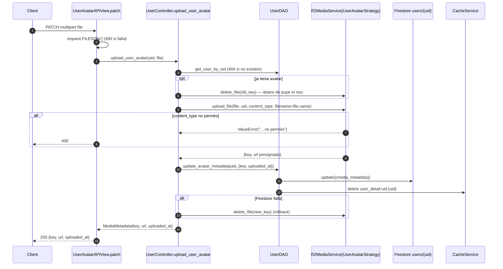

# Flux 2 — Avatar d'usuari

> **[FET]** comprovat al codi · **[INFERÈNCIA]** deducció · **[NO VERIFICAT]** depèn de config externa.

## Endpoints (`api/views/user_views.py`)
| Mètode | URL | Vista | Permisos | Body |
|---|---|---|---|---|
| PATCH | `/api/users/{uid}/avatar/` | `UserAvatarAPIView.patch` (L647) | IsAuthenticated + IsSameUser | multipart, camp `file` (parsers L605-606) |
| DELETE | `/api/users/{uid}/avatar/` | `.delete` (L708) | idem | — |

Emmagatzematge: R2 amb `UserAvatarStrategy` → clau `users-avatars/{uid}/{filename}`, només imatges (`api/services/r2_media_service.py:101-145`). Firestore: `users/{uid}.media_metadata = {key, uploaded_at}`.

## Diagrama — pujar avatar

## Passos (`api/controllers/user_controller.py`)
1. `upload_user_avatar` (L470-533): comprova usuari, **esborra l'avatar antic primer** (L488-495), puja el nou (L503), actualitza metadades (`api/daos/user_dao.py:580-614`), rollback del fitxer nou si falla Firestore (L515-519).
2. `delete_user_avatar` (L535-571): `UserDAO.delete_avatar_metadata` (`api/daos/user_dao.py:616-652`, posa `media_metadata: None`) i després `delete_file`.

## Errors
| Cas | HTTP |
|---|---|
| Sense fitxer | 400 |
| MIME no permès | 400 (match de `'no permès'`) |
| Usuari no trobat / sense avatar (DELETE) | 404 |
| Altres | 500 |
| DELETE OK | 204 |

## Gotchas
- L'avatar antic s'esborra **abans** de pujar el nou: si la pujada falla, Firestore apunta a una clau inexistent **[FET]**.
- El rollback de DELETE (re-posar metadades si R2 falla, L557-564) no s'executa mai perquè `delete_file` retorna `False` en lloc de llançar **[FET]**.
- La clau usa el nom original del fitxer **[FET]**; per a l'avatar és menys greu (prefix per usuari).
- No hi ha límit de mida **[FET]**.
