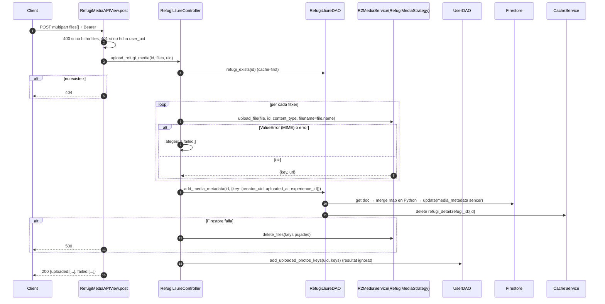
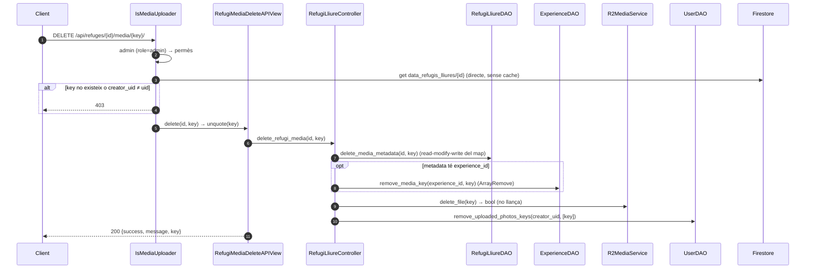

# Flux 3 — Pujar, llistar i esborrar fotos/vídeos d'un refugi

> **[FET]** comprovat al codi · **[INFERÈNCIA]** deducció · **[NO VERIFICAT]** depèn de config externa.

## Endpoints (`api/views/refugi_media_views.py`)
| Mètode | URL | Vista | Permisos | Body |
|---|---|---|---|---|
| GET | `/api/refuges/{id}/media/` | `RefugiMediaAPIView.get` (L69) | IsAuthenticated | — |
| POST | `/api/refuges/{id}/media/` | `.post` (L138) | IsAuthenticated | multipart, llista `files` |
| DELETE | `/api/refuges/{id}/media/{key}/` | `RefugiMediaDeleteAPIView.delete` (L225) | IsAuthenticated + IsMediaUploader | — (`key` és `path:` i pot contenir `/`) |

## Model de dades [FET]
- R2: clau `refugis-lliures/{refuge_id}/{filename}` (`RefugiMediaStrategy`, `api/services/r2_media_service.py:44-98`). Tipus permesos: jpeg/jpg/png/webp/heic/heif + mp4/quicktime/x-msvideo/webm.
- Firestore, dins el document del refugi: `data_refugis_lliures/{id}.media_metadata = { "<clau R2>": {creator_uid, uploaded_at, experience_id|None} }`.
- Usuari: `users/{uid}.uploaded_photos_keys: [claus]`.
- Experiència (si n'hi ha): `experiences/{id}.media_keys: [claus]`.
- La URL **no** es desa: es presigna en llegir (3600 s). Models: `MediaMetadata`, `RefugeMediaMetadata` (`api/models/media_metadata.py:9-78`).
- Dos noms, dues coses: `media_metadata` és el **map desat a Firestore** (sense URL); `images_metadata` és la **llista que retorna l'API** (`[{key, url, creator_uid, uploaded_at, experience_id}]`), generada en llegir. Versions antigues usaven `media_keys` / `images_urls` (obsolet).
- Configurar R2: [guides/r2-render-setup.md](../guides/r2-render-setup.md).

## Diagrama — pujar

## Diagrama — esborrar

## Passos (amb línies)
- Pujada: `api/views/refugi_media_views.py:143-160` → `RefugiLliureController.upload_refugi_media` (`api/controllers/refugi_lliure_controller.py:153-240`) → `RefugiLliureDAO.add_media_metadata` (`api/daos/refugi_lliure_dao.py:394-429`) → `UserDAO.add_uploaded_photos_keys` (`api/daos/user_dao.py:367-408`).
- Llistat: `RefugiLliureController.get_refugi_media` (`api/controllers/refugi_lliure_controller.py:129-151`) → `RefugiLliureDAO.get_media_metadata` (`api/daos/refugi_lliure_dao.py:361-392`), **sense cache**, presigna cada clau.
- Esborrat: `IsMediaUploader` (`api/permissions.py:192-276`) → `delete_refugi_media` (`api/controllers/refugi_lliure_controller.py:242-294`) → `delete_media_metadata` (`api/daos/refugi_lliure_dao.py:431-476`).
- Esborrat massiu intern (experiències, usuari, refugi): `delete_multiple_refugi_media` (`api/controllers/refugi_lliure_controller.py:296-370`) → `delete_multiple_media_metadata` (`api/daos/refugi_lliure_dao.py:478-539`), que retorna `(False, [])` si **cap** clau existeix.

## Errors
| Cas | HTTP |
|---|---|
| Sense fitxers | 400 |
| Refugi no trobat | 404 |
| Media inexistent o d'un altre usuari (DELETE) | **403** (no 404) |
| MIME no permès | dins `failed[]`, resposta 200 |
| Error Firestore | 500 |

## Gotchas i bugs
- **Col·lisió de claus**: el nom original del fitxer forma part de la clau → dues pujades `IMG_0001.jpg` al mateix refugi se sobreescriuen a R2 i al map **[FET]** (`api/controllers/refugi_lliure_controller.py:185`, `api/services/r2_media_service.py:196-203`).
- **Lost updates**: el map `media_metadata` i `uploaded_photos_keys` es reescriuen sencers **[FET patró / INFERÈNCIA carrera]**.
- R2 que falla en esborrar es reporta com a èxit (rollback mort, `api/controllers/refugi_lliure_controller.py:267-282`) **[FET]**.
- Només es valida el `content_type` declarat pel client; sense límit de mida **[FET]**.
- `unquote` a la vista sobre un path que Django ja ha decodificat → doble decodificació de `%25` **[INFERÈNCIA]**.
- Swagger documenta 204 per al DELETE però retorna 200 **[FET]**.
- `Refugi.to_dict()` reconstrueix `media_metadata` **sense** `experience_id` (`api/models/refugi_lliure.py:110-117`) — latent si algú torna a desar el refugi des del model **[FET]**.
