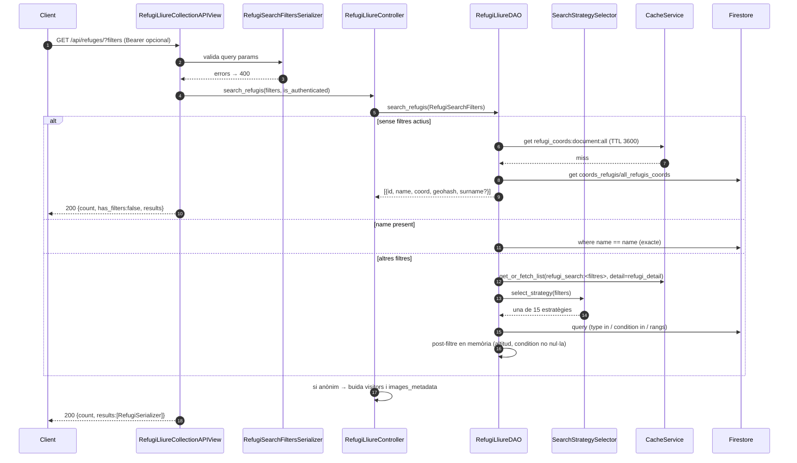

# Flux 4 — Cerca, coordenades i detall de refugis

> **[FET]** comprovat al codi · **[INFERÈNCIA]** deducció · **[NO VERIFICAT]** depèn de config externa.

## Endpoints (`api/views/refugi_lliure_views.py`)
| Mètode | URL | Vista | Permisos |
|---|---|---|---|
| GET | `/api/refuges/` (sense filtres → llista de coordenades) | `RefugiLliureCollectionAPIView.get` (L121) | públic; el token és opcional i desbloqueja `visitors`/`images_metadata` |
| GET | `/api/refuges/?name=&type=&condition=&places_min=&places_max=&altitude_min=&altitude_max=` | idem | idem |
| GET | `/api/refuges/{id}/` | `RefugiLliureDetailAPIView.get` (L206) | públic |
| GET | `/api/refuges/{id}/renovations/` | `RefugeRenovationsAPIView.get` (L282) | IsAuthenticated |

Col·leccions: `data_refugis_lliures/{id}` (detall) i el document únic `coords_refugis/all_refugis_coords` (camp `refugis_coordinates[]`) (`api/daos/refugi_lliure_dao.py:18-19`).

## Diagrama

## Passos
1. **Validació** — `RefugiSearchFiltersSerializer` (`api/serializers/refugi_lliure_serializer.py:82-164`): `type` CSV contra tipus vàlids; `condition` CSV ∈ {0,1,2}; `places_*` ≥0; `altitude_*` 0–8848 i min≤max.
2. **Controller** — `RefugiLliureController.search_refugis` (`api/controllers/refugi_lliure_controller.py:50-98`) construeix `RefugiSearchFilters` (`api/models/refugi_lliure.py:215-281`).
3. **DAO** — `RefugiLliureDAO.search_refugis` (`api/daos/refugi_lliure_dao.py:54-112`):
   - sense filtres: `_get_coordinates_as_refugi_list` (L114-164);
   - amb `name`: `_search_by_name` (L204-226), igualtat **exacta**;
   - altres: `_build_optimized_query` (L180-202) → `SearchStrategySelector.select_strategy` (`api/daos/search_strategies.py:499-583`).
4. **Mapper** — `RefugiLliureMapper.format_search_response` (`api/mappers/refugi_lliure_mapper.py:80-99`); `RefugiSerializer.to_representation` (`api/serializers/refugi_lliure_serializer.py:56-75`) arrodoneix `condition` i elimina camps privats per a anònims.
5. **Detall** — `RefugiLliureController.get_refugi_by_id` (`api/controllers/refugi_lliure_controller.py:24-48`) → `RefugiLliureDAO.get_by_id` (`api/daos/refugi_lliure_dao.py:23-52`), cache `refugi_detail:refugi_id:{id}` (600 s); `Refugi.from_dict` presigna les fotos.

## Estratègies de cerca (`api/daos/search_strategies.py`)
Interfície `RefugiSearchStrategy` (L42-63): `execute_query(db, collection, filters)`, `get_strategy_name()`. El selector tria per combinació de filtres presents (prioritat de més a menys específica):
`TypeConditionPlacesAltitude` → `TypeConditionPlaces` → `TypeConditionAltitude` → `TypeCondition` → `TypePlacesAltitude` → `TypePlaces` → `TypeAltitude` → `TypeOnly` → `ConditionPlacesAltitude` → `ConditionPlaces` → `ConditionAltitude` → `ConditionOnly` → `PlacesAltitude` → `PlacesOnly` → `AltitudeOnly`.
Patró general: com a màxim un filtre de rang a Firestore (places o altitude); la resta es filtra en memòria. **[FET]** per a la llista; detall de cada query a les classes citades.

## Errors
| Cas | HTTP |
|---|---|
| Query params invàlids | 400 `{error:'Invalid query parameters', details}` |
| Refugi no trobat | 404 `"Refugi not found"` |
| Error intern | 500 `{'error': 'Internal server error: ...'}` (exposa el text de l'excepció) |
| Error llegint coords | **200 amb llista buida** (el DAO retorna `[]`) |

## Gotchas i bugs
- La cerca per nom és exacta, però Swagger diu "parcial, case-insensitive" (`api/views/refugi_lliure_views.py:60`) **[FET]**.
- `condition` és una mitjana float (`api/services/condition_service.py:39`) però el filtre exigeix 0/1/2 exactes → refugis amb 1.6 no surten mai filtrant **[FET]**. El model diu 0–3 (`api/models/refugi_lliure.py:93`), el filtre 0–2.
- `_search_by_name` retorna `doc.to_dict()` sense afegir `id`: depèn que el document desi el camp `id` (sí ho fan `upload_refugis_to_firestore` i `CreateRefugeStrategy`) **[FET/INFERÈNCIA]**.
- Dos `in` a la mateixa query (type + condition) requereixen suport de disjuncions de Firestore i índexs compostos **[NO VERIFICAT]** (no hi ha `firestore.indexes.json`).
- `GET /refuges/{id}/renovations/`: `active_only` no es llegeix de la query (`api/views/refugi_lliure_views.py:282-286`) **[FET]**.
- Les llistes de cerca no s'invaliden quan una proposta modifica un refugi (vegeu [flux 5](05-refuge-proposals.md)).
