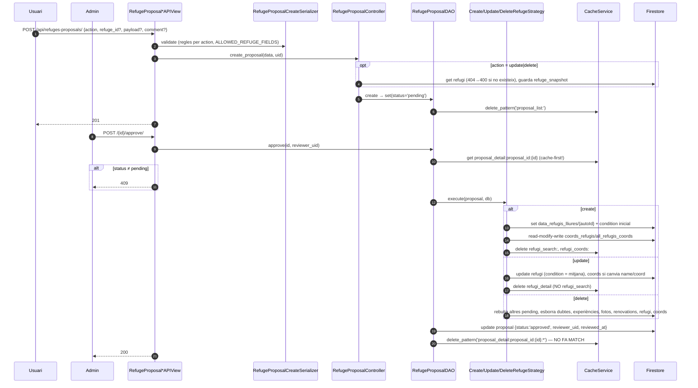

# Flux 5 — Propostes de refugi (crear / editar / esborrar) i revisió admin

> **[FET]** comprovat al codi · **[INFERÈNCIA]** deducció · **[NO VERIFICAT]** depèn de config externa.

Els usuaris **no modifiquen refugis directament**: creen una *proposta* que un admin aprova o rebutja. En aprovar-la, una Strategy aplica el canvi a Firestore.

## Endpoints (`api/views/refuge_proposal_views.py`)
| Mètode | URL | Vista | Permisos |
|---|---|---|---|
| POST | `/api/refuges-proposals/` | `RefugeProposalCollectionAPIView.post` (L93) | IsAuthenticated |
| GET | `/api/refuges-proposals/?status=&refuge-id=` | `.get` (L171) | IsFirebaseAdmin |
| GET | `/api/my-refuges-proposals/?status=` | `MyRefugeProposalCollectionAPIView.get` (L241) | IsAuthenticated |
| POST | `/api/refuges-proposals/{id}/approve/` | `RefugeProposalApproveAPIView.post` (L315) | IsFirebaseAdmin |
| POST | `/api/refuges-proposals/{id}/reject/` (`{reason?}`) | `RefugeProposalRejectAPIView.post` (L386) | IsFirebaseAdmin |

Col·lecció: `refuges_proposals/{id}` = `{id, refuge_id, refuge_snapshot, action(create|update|delete), payload, comment, status(pending|approved|rejected), creator_uid, created_at, reviewer_uid, reviewed_at, rejection_reason}` (`api/daos/refuge_proposal_dao.py:582-616`).

## Diagrama — crear i aprovar

## Passos
> Detall: validació i exemples de payload + sincronització de `coords_refugis` → [deep-dives/refuge-proposals-payload.md](../deep-dives/refuge-proposals-payload.md) · càlcul de la condició mitjana → [deep-dives/condition-average.md](../deep-dives/condition-average.md) · fer-se admin per revisar → [guides/admin-management.md](../guides/admin-management.md).

1. **Validació** (`api/serializers/refuge_proposal_serializer.py:85-166`): `create` requereix payload amb `name` i `coord` i cap `refuge_id`; `update` requereix `refuge_id` + payload; `delete` requereix `refuge_id` i cap payload. Claus del payload ⊂ `ALLOWED_REFUGE_FIELDS` (L14-17).
2. **Crear** — `RefugeProposalController.create_proposal` (`api/controllers/refuge_proposal_controller.py:19-61`) → `RefugeProposalDAO.create` (`api/daos/refuge_proposal_dao.py:582-616`).
3. **Llistar** — `list_proposals` (`api/controllers/refuge_proposal_controller.py:85-117`) → `RefugeProposalDAO.list_all` (`api/daos/refuge_proposal_dao.py:646-734`), ID caching amb `proposal_list:*` i detalls `proposal_detail`.
4. **Aprovar** — `RefugeProposalDAO.approve` (L736-776) → `ProposalStrategySelector.get_strategy` (L559-570):
   - `CreateRefugeStrategy` (L231-305): construeix `Refugi` + `RefugiLliureMapper.model_to_firestore`; `ConditionService.initialize_condition` si hi ha `condition`; `add_refuge_to_coords_refugis` (L62-110).
   - `UpdateRefugeStrategy` (L308-385): `ConditionService.calculate_condition_average` (`api/services/condition_service.py:13-51`, `new=(cur*n+v)/(n+1)`); `update_refuge_from_coords_refugis` si canvia nom/coord.
   - `DeleteRefugeStrategy` (L388-556): rebutja altres pending → `DoubtController.delete_doubt` × N → `ExperienceController.delete_experience` × N → fotos restants → `RenovationController.delete_renovation` × N → esborra refugi → `delete_refuge_from_coords_refugis` (L178-209).
5. **Rebutjar** — `RefugeProposalDAO.reject` (L778-812).

## Errors
| Cas | HTTP |
|---|---|
| Validació / refugi inexistent en update/delete / filtres incompatibles | 400 |
| No admin | 403 |
| Proposta (o refugi a aprovar) no trobada | 404 |
| Ja aprovada/rebutjada | 409 |
| Altres | 500 |

## Gotchas i bugs
- **Doble aprovació possible** durant 600 s: la invalidació usa `...:{id}:*` però la clau és `proposal_detail:proposal_id:{id}` (L620 vs L770/L806) → `approve` torna a llegir `pending` de cache **[FET format / INFERÈNCIA efecte]**. Vegeu [TECH_DEBT C2](../TECH_DEBT.md).
- **Esborrat a mitges**: les claus de fotos es llegeixen (L409) abans d'esborrar experiències; si totes eren d'experiències, `delete_multiple_media_metadata` retorna `False` i l'aprovació falla amb 500 després d'haver esborrat dubtes i experiències **[FET]**.
- Cap escriptura de les strategies és transaccional; `coords_refugis/all_refugis_coords` es reescriu sencer (lost updates amb aprovacions concurrents) **[FET patró / INFERÈNCIA carrera]**.
- Update no invalida `refugi_search` (L375) ni `user_refugis_info` **[FET]**.
- Delete no neteja `refuge_visits` ni les llistes de preferits/visitats dels usuaris (acceptat explícitament a L394-395) **[FET]**.
- El payload es desa en brut (sense coerció de tipus) **[FET]**: `"altitude": "1200"` es desaria com a string **[INFERÈNCIA]**.
- La lògica de negoci (strategies que criden controllers d'altres dominis) viu dins el **DAO**, excepció al patró de capes **[FET]**.
- Anonimització en esborrar usuari: `creator_uid='unknown'` (L814-849) **[FET]**.
