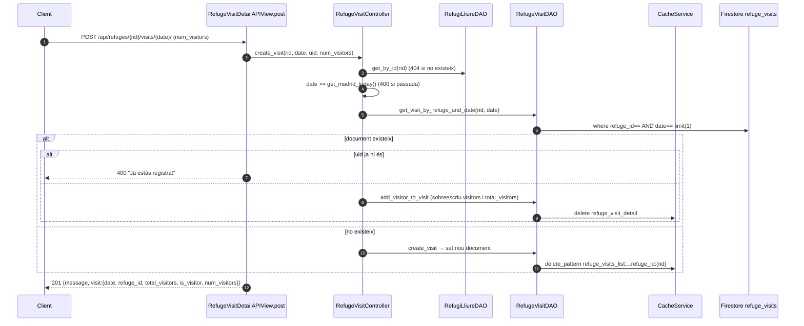
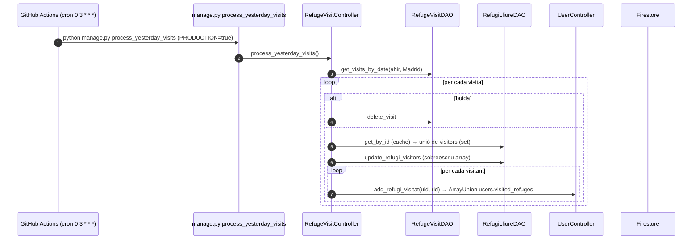

# Flux 6 — Visites planificades i procés diari

> **[FET]** comprovat al codi · **[INFERÈNCIA]** deducció · **[NO VERIFICAT]** depèn de config externa.

Un usuari indica que anirà a un refugi en una data (amb `num_visitors`). Cada nit, un procés converteix les visites d'ahir en "refugis visitats".

## Endpoints (`api/views/refuge_visit_views.py`)
| Mètode | URL | Vista | Permisos | Body |
|---|---|---|---|---|
| GET | `/api/refuges/{refuge_id}/visits/` | `RefugeVisitsAPIView.get` (L61) | IsAuthenticated | — |
| POST | `/api/refuges/{refuge_id}/visits/{YYYY-MM-DD}/` | `RefugeVisitDetailAPIView.post` (L202) | IsAuthenticated | `{num_visitors ≥ 1}` |
| PATCH | idem | `.patch` (L286) | IsAuthenticated | `{num_visitors}` |
| DELETE | idem | `.delete` (L359) | IsAuthenticated | — |
| GET | `/api/users/{uid}/visits/` | `UserVisitsAPIView.get` (L133) | IsAuthenticated + IsSameUser | — |

L'UID sempre surt del token: només es pot actuar sobre la pròpia entrada **[FET]**.

Col·lecció `refuge_visits/{autoId}` = `{id, date:'YYYY-MM-DD', refuge_id, visitors:[{uid, num_visitors}], total_visitors}` (model `api/models/refuge_visit.py`, mapper `api/mappers/refuge_visit_mapper.py`). Un document per (refugi, data).

## Privacitat i format de resposta
Les respostes **mai** exposen la llista `visitors` amb UIDs d'altres usuaris. Cada visita es serialitza com `{date, total_visitors, is_visitor, num_visitors}` (+ `refuge_id` al llistat per usuari), on `is_visitor`/`num_visitors` es calculen respecte a l'usuari del token (`api/serializers/refuge_visit_serializer.py:56-82`) **[FET]**. El llistat per refugi només inclou dates ≥ avui (ordre ascendent); el d'usuari, ordre descendent.

## Diagrama — registrar visita

## Diagrama — procés diari

## Passos
- Crear: `RefugeVisitController.create_visit` (`api/controllers/refuge_visit_controller.py:76-156`); DAO `get_visit_by_refuge_and_date` (`api/daos/refuge_visit_dao.py:96-136`), `create_visit` (L26-54), `add_visitor_to_visit` (L250-287).
- Editar: `update_visit` (controller L158-208) — **sense** comprovació de data ni d'existència del refugi **[FET]**.
- Sortir: `delete_visit` (controller L210-240) → `remove_visitor_from_visit` (DAO L328-385). Retorna 200, no 204.
- Llistar per refugi: ID caching `refuge_visits_list:from_date:<avui>:refuge_id:X`, query `refuge_id==, date>=avui, order_by date`.
- Llistar per usuari: `get_visits_by_user` (DAO L207-248) fa **stream de tota la col·lecció** i filtra en Python **[FET]**.
- Procés diari: `api/management/commands/process_yesterday_visits.py:15-38` → `RefugeVisitController.process_yesterday_visits` (controller L242-312); `RefugiLliureDAO.update_refugi_visitors` (`api/daos/refugi_lliure_dao.py:541-575`).
- Com executar-lo (Actions, manual, crontab): [guides/daily-visits-process.md](../guides/daily-visits-process.md).
- Planificació real: `.github/workflows/process-visits.yml:1-37` (cron `0 3 * * *` UTC, `PRODUCTION='true'`). Alternatives no actives: `CRONJOBS` a `refugis_lliures/settings.py:275-278` (django-crontab, mai instal·lat) i `run_process_visits.sh` / `run_process_visits.bat` (manual) **[FET]**.

## Errors
| Cas | HTTP |
|---|---|
| Refugi no trobat | 404 |
| Data passada / ja registrat / `num_visitors` invàlid | 400 |
| `uid` URL ≠ token (llistat d'usuari) | 403 |
| Altres | 500 |

## Gotchas i bugs
- Dues primeres inscripcions concurrents per al mateix (refugi, data) poden crear **dos documents**; `limit(1)` n'amaga un **[INFERÈNCIA]**.
- `visitors` es reescriu sencer a partir d'una lectura prèvia → lost updates **[FET patró / INFERÈNCIA carrera]**.
- Esborrar un usuari resta 1 a `total_visitors` en lloc de `num_visitors` (`api/daos/refuge_visit_dao.py:529`) **[FET]**.
- El procés diari no esborra les visites processades (només les buides) → la col·lecció creix i el scan per usuari empitjora **[FET]**.
- El workflow no defineix `REDIS_URL` → no invalida la cache de producció **[INFERÈNCIA]**.
- `add_refugi_visitat` torna a escriure `visitors` del refugi després de `update_refugi_visitors` (escriptura redundant) **[FET segons traça del controller]**.
