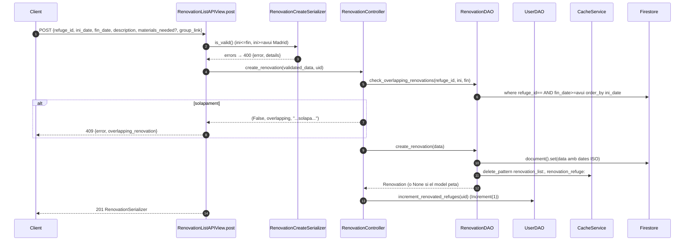
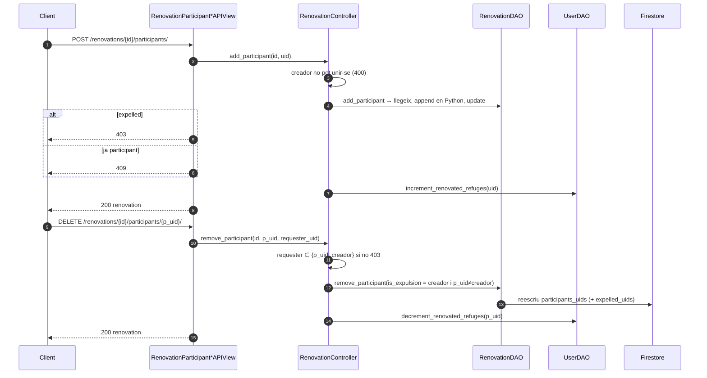

# Flux 7 — Renovations (reformes) i participants

> **[FET]** comprovat al codi · **[INFERÈNCIA]** deducció · **[NO VERIFICAT]** depèn de config externa.

És el **domini de referència** del patró de capes (vegeu [ARCHITECTURE §3](../ARCHITECTURE.md)).

## Endpoints (`api/views/renovation_views.py`)
| Mètode | URL | Vista | Permisos efectius |
|---|---|---|---|
| GET | `/api/renovations/` (només actives) | `RenovationListAPIView.get` (L71) | IsAuthenticated |
| POST | `/api/renovations/` | `.post` (L124) | IsAuthenticated |
| GET | `/api/renovations/{id}/` | `RenovationAPIView.get` (L216) | IsAuthenticated |
| PATCH / DELETE | `/api/renovations/{id}/` | `.patch` (L288) / `.delete` (L369) | IsAuthenticated; `IsRenovationCreator` declarat (L182-190) però **no s'executa** → el controller comprova el creador |
| POST | `/api/renovations/{id}/participants/` | `RenovationParticipantsAPIView.post` (L448) | IsAuthenticated |
| DELETE | `/api/renovations/{id}/participants/{uid}/` | `RenovationParticipantDetailAPIView.delete` (L540) | IsAuthenticated; controller: creador o el propi participant |
| GET | `/api/refuges/{id}/renovations/` | `RefugeRenovationsAPIView` (`api/views/refugi_lliure_views.py:282`) | IsAuthenticated |

Col·lecció `renovations/{autoId}` = `{id, creator_uid, refuge_id, ini_date:'YYYY-MM-DD', fin_date, description, materials_needed, group_link, participants_uids[], expelled_uids[]}` (`api/models/renovation.py:8-20`). Comptador a l'usuari: `users.num_renovated_refuges`.

## Diagrama — crear

## Diagrama — unir-se / sortir / expulsar

## Passos (amb línies)
- Controller complet: `api/controllers/renovation_controller.py` — `create_renovation` (L21-61), `get_renovation_by_id` (L63-82), `get_all_renovations` (L84-98), `update_renovation` (L100-154), `delete_renovation` (L156-196), `add_participant` (L198-242), `remove_participant` (L244-285), `get_renovations_by_refuge` (L287-303), funcions de cascada d'esborrat d'usuari (L305-397).
- DAO: `api/daos/renovation_dao.py` — `create_renovation` (L25-67), `get_renovation_by_id` (L69-109, cache `renovation_detail`), `get_all_renovations` (L111-176, ID caching `renovation_list:date:<avui>:list_type:active`), `check_overlapping_renovations` (L345-402), participants (L404-507).
- Comptadors: `UserDAO.increment_renovated_refuges` / `decrement_renovated_refuges` (`api/daos/user_dao.py:334-365`, `537-578`).

## Errors
| Cas | HTTP |
|---|---|
| Validació | 400 |
| Creador intenta unir-se | 400 |
| No és el creador (PATCH/DELETE) / no autoritzat a treure participant / expulsat | 403 |
| No trobada | 404 |
| Solapament / ja participant | 409 |
| Error intern | 500 |
| DELETE renovation OK | 204 |

## Gotchas i bugs
- **`ini_date == fin_date`**: el serializer ho accepta (`api/serializers/renovation_serializer.py:24`), el model no (`api/models/renovation.py:32-33`); el document ja s'ha desat (`api/daos/renovation_dao.py:54`) → **la llista d'actives queda buida per a tothom** (`api/daos/renovation_dao.py:174-176`) **[FET]**.
- PATCH amb una sola data → `TypeError` date vs datetime → 500 (`api/controllers/renovation_controller.py:124-128`) **[FET]**.
- Un admin **no** pot editar/esborrar renovations d'altres: el controller compara només `creator_uid` (L119, L174) tot i que `IsRenovationCreator` pretenia deixar passar admins **[FET]**.
- PATCH invalida només `renovation_detail`, no les llistes (L178-226) **[FET]**.
- No es comprova que `refuge_id` existeixi en crear **[FET]**.
- Join/leave fan read-modify-write de `participants_uids` en lloc d'`ArrayUnion`/`ArrayRemove` **[FET]**; els comptadors d'usuari es poden desquadrar **[INFERÈNCIA]**.
- `where fin_date >= …` + `order_by ini_date`: Firestore exigeix tradicionalment que el primer `order_by` sigui el camp de la desigualtat; que funcioni depèn de la versió/índexs **[NO VERIFICAT]** (`api/daos/renovation_dao.py:131-133`).
- La vista decideix el 409 buscant `'solapa'` al missatge (`api/views/renovation_views.py:150`) **[FET]**.
