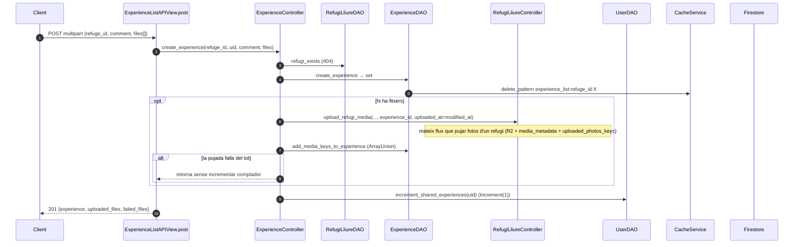

# Flux 8 — Experiències amb fotos

> **[FET]** comprovat al codi · **[INFERÈNCIA]** deducció · **[NO VERIFICAT]** depèn de config externa.

## Endpoints (`api/views/experience_views.py`)
| Mètode | URL | Vista | Permisos efectius | Body |
|---|---|---|---|---|
| GET | `/api/experiences/?refuge_id=X` | `ExperienceListAPIView.get` (L63) | IsAuthenticated | — |
| POST | `/api/experiences/` | `.post` (L142) | IsAuthenticated | multipart `refuge_id`, `comment`, `files[]` |
| PATCH | `/api/experiences/{experience_id}/` | `ExperienceDetailAPIView.patch` (L278) | **només IsAuthenticated** (IsExperienceCreator no s'executa) | multipart `comment?`, `files[]?` |
| DELETE | `/api/experiences/{experience_id}/` | `.delete` (L364) | **només IsAuthenticated** | — |

Col·lecció `experiences/{autoId}` = `{id, refuge_id, creator_uid, comment, modified_at, media_keys[]}` (`api/models/experience.py:14-23`). Les metadades de les fotos viuen al refugi (`media_metadata[key].experience_id`), vegeu [flux 3](03-refuge-media-upload.md).

## Diagrama — crear amb fotos

## Passos
- Crear: `ExperienceController.create_experience` (`api/controllers/experience_controller.py:54-130`); `ExperienceDAO.create_experience` (`api/daos/experience_dao.py:25-54`); `_upload_experience_media_to_refuge` (controller L245-286); `add_media_keys_to_experience` (DAO L246-282); `UserDAO.increment_shared_experiences` (`api/daos/user_dao.py:410-445`).
- Llistar: `ExperienceDAO.get_experiences_by_refuge_id` (L98-161), ID caching `experience_list:refuge_id:X`, `order_by modified_at desc`; `Experience.from_dict` presigna `media_keys`.
- Editar: controller L132-194 → `ExperienceDAO.update_experience` (L163-205, `ArrayUnion` per a `media_keys`, invalida només el detall).
- Esborrar: controller L196-243 → `delete_multiple_refugi_media` → `ExperienceDAO.delete_experience` (L207-244) → `decrement_shared_experiences` (`api/daos/user_dao.py:447-492`). Retorna 200, no 204.

## Errors
| Cas | HTTP |
|---|---|
| Falta `refuge_id` al GET | 400 |
| Refugi / experiència no trobats | 404 (match de `"not found"`) |
| Altres | 500 |

## Gotchas i bugs
- **Sense control de propietat** (crític): qualsevol usuari autenticat pot editar o esborrar l'experiència d'un altre — `update_experience`/`delete_experience` ni tan sols reben l'UID de qui fa la petició (`api/controllers/experience_controller.py:132-136,196`) **[FET]**. Les fotos noves s'atribueixen al creador original (L169-174).
- Si la pujada de media falla del tot, l'experiència existeix però el comptador no s'incrementa; després el DELETE el decrementa → desquadrament **[FET]**.
- Error path del PATCH: `result.to_dict()` amb `result=None` (`api/views/experience_views.py:310-312`) → 500 genèric **[FET]**.
- Experiències **no** porten condició ni valoració; `ConditionService` només s'usa a propostes i comandes **[FET]**.
- Cap transacció entre experiència, `media_metadata`, `uploaded_photos_keys` i comptador **[FET]**.
