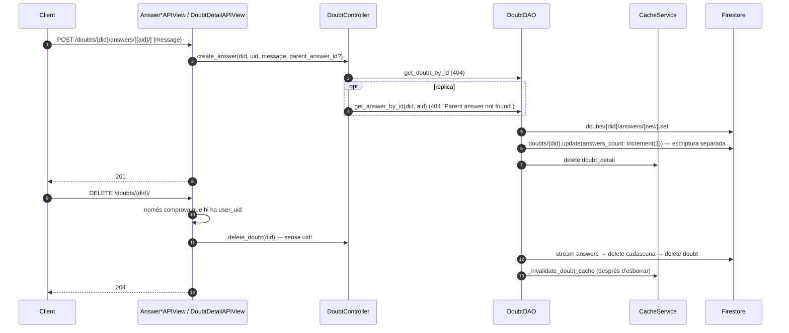

# Flux 9 — Dubtes i respostes

> **[FET]** comprovat al codi · **[INFERÈNCIA]** deducció · **[NO VERIFICAT]** depèn de config externa.

## Endpoints (`api/views/doubt_views.py`)
| Mètode | URL | Vista | Permisos efectius | Body |
|---|---|---|---|---|
| GET | `/api/doubts/?refuge_id=X` | `DoubtListAPIView.get` (L76) | IsAuthenticated | — |
| POST | `/api/doubts/` | `.post` (L134) | IsAuthenticated | `{refuge_id, message ≤ 2000}` |
| DELETE | `/api/doubts/{doubt_id}/` | `DoubtDetailAPIView.delete` (L223) | **només IsAuthenticated** (IsDoubtCreator no s'executa) | — |
| POST | `/api/doubts/{doubt_id}/answers/` | `AnswerListAPIView.post` (L306) | IsAuthenticated | `{message}` |
| POST | `/api/doubts/{doubt_id}/answers/{answer_id}/` (rèplica) | `AnswerReplyAPIView.post` (L419) | IsAuthenticated | `{message}` |
| DELETE | `/api/doubts/{doubt_id}/answers/{answer_id}/` | `.delete` (L506) | **només IsAuthenticated** (IsAnswerCreator no s'executa) | — |

Firestore: `doubts/{id} = {id, refuge_id, creator_uid, message, created_at, answers_count}`; subcol·lecció `doubts/{id}/answers/{aid} = {id, creator_uid, message, created_at, parent_answer_id}` (rèpliques planes, enllaçades per `parent_answer_id`) (`api/daos/doubt_dao.py:18-19`).

## Diagrama — respondre i esborrar

## Passos
- Crear dubte: `DoubtController.create_doubt` (`api/controllers/doubt_controller.py:46-89`) → `refugi_exists` → `DoubtDAO.create_doubt` (`api/daos/doubt_dao.py:27-56`, invalida `doubt_list:refuge_id:X`).
- Crear resposta: controller L91-142 → `DoubtDAO.create_answer` (L218-254).
- Esborrar resposta: controller L172-208 → DAO L286-319 (`Increment(-1)`); **no** esborra rèpliques filles (documentat a Swagger, L478).
- Esborrar dubte: controller L144-170 → DAO L321-357 → `_invalidate_doubt_cache` (L368-386).
- Llistar: DAO L100-184, ID caching `doubt_list:refuge_id:X`, `order_by created_at desc` + per a cada dubte stream de respostes `asc` (N+1).

## Errors
| Cas | HTTP |
|---|---|
| Validació / falta `refuge_id` | 400 |
| Refugi, dubte o resposta pare no trobats | 404 (match `"not found"`, `api/views/doubt_views.py:240`) |
| Altres | 500 |
| DELETE OK | 204 |

## Gotchas i bugs
- **Qualsevol usuari autenticat pot esborrar qualsevol dubte (amb totes les respostes) o resposta** **[FET]**: `delete_doubt(doubt_id)` no rep l'UID (`api/controllers/doubt_controller.py:144`) i el permís d'objecte no s'executa.
- `doubt_detail` es desa amb i sense `answers` segons el camí (`api/daos/doubt_dao.py:86-88` vs `129-153`) → un dubte pot sortir amb `answers: []` i `answers_count > 0` fins a 10 min **[FET]**.
- `_invalidate_doubt_cache` corre després d'esborrar, així que no pot llegir `refuge_id` i no invalida la llista (L380-383); funciona igualment perquè l'ID caching salta IDs inexistents, amb una lectura extra **[FET]**.
- Comptador `answers_count` i escriptura de la resposta no són atòmics **[FET]**.
- Les rèpliques a una resposta esborrada conserven `parent_answer_id` penjant **[FET]**.
- La vista crea el controller a `__init__` (`api/views/doubt_views.py:46,195,273,368`), a diferència de renovations **[FET]**.
