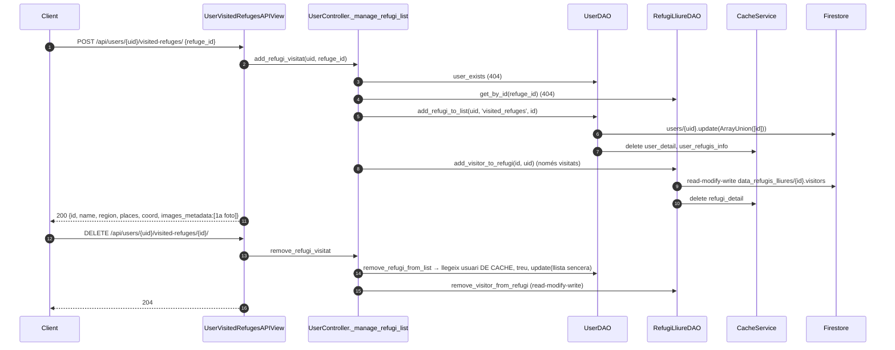

# Flux 10 — Refugis preferits i visitats

> **[FET]** comprovat al codi · **[INFERÈNCIA]** deducció · **[NO VERIFICAT]** depèn de config externa.

## Endpoints (`api/views/user_views.py`)
| Mètode | URL | Vista | Controller |
|---|---|---|---|
| GET / POST | `/api/users/{uid}/favorite-refuges/` | `UserFavouriteRefugesAPIView` (L285-391) | `get_refugis_preferits_info` / `add_refugi_preferit` |
| DELETE | `/api/users/{uid}/favorite-refuges/{refuge_id}/` | `UserFavouriteRefugesDetailAPIView` (L396-437) | `remove_refugi_preferit` |
| GET / POST | `/api/users/{uid}/visited-refuges/` | `UserVisitedRefugesAPIView` (L442-548) | `get_refugis_visitats_info` / `add_refugi_visitat` |
| DELETE | `/api/users/{uid}/visited-refuges/{refuge_id}/` | `UserVisitedRefugesDetailAPIView` (L553-594) | `remove_refugi_visitat` |

Permisos: IsAuthenticated + IsSameUser. Body del POST: `UserRefugiSerializer` → `{refuge_id}` (`api/serializers/user_serializer.py:165-171`).

Dades: `users/{uid}.favourite_refuges[]`, `users/{uid}.visited_refuges[]`; per als visitats també `data_refugis_lliures/{id}.visitors[]`.

## Diagrama

## Passos
- Template method: `UserController._manage_refugi_list` (`api/controllers/user_controller.py:279-342`) + hook `_update_refugi_visitor_list` (L344-362).
- Afegir: `UserDAO.add_refugi_to_list` (`api/daos/user_dao.py:182-216`) — atòmic amb `ArrayUnion`.
- Treure: `UserDAO.remove_refugi_from_list` (`api/daos/user_dao.py:218-264`) — **no atòmic**, llegeix de cache (L232).
- Visitants del refugi: `RefugiLliureDAO.add_visitor_to_refugi` / `remove_visitor_from_refugi` (`api/daos/refugi_lliure_dao.py:273-359`).
- Llegir llista amb info: `UserDAO.get_refugis_info` (`api/daos/user_dao.py:266-332`), cache `user_refugis_info:list_name:L:uid:X` → `{count, results}`; format per `RefugiLliureMapper.dict_to_refugi_info_representation` (`api/mappers/refugi_lliure_mapper.py:39-71`).

## Errors
| Cas | HTTP |
|---|---|
| Usuari o refugi no trobat | 404 |
| `uid` URL ≠ token | 403 |
| POST OK | **200** (no 201) |
| DELETE OK | 204 |

## Gotchas i bugs
- Treure d'una llista llegeix l'usuari **de cache** i reescriu l'array sencer → pot perdre un afegit concurrent **[FET patró / INFERÈNCIA carrera]**. Existeix `ArrayRemove` i s'usa a l'esborrat d'usuari; aquí no.
- `add_refugi_to_list`/`remove_refugi_from_list` retornen tuples (truthy) → `if not success` del controller (L323) no detecta fallades **[FET]**; ho tapa el `user_exists` previ.
- `user_refugis_info` no s'invalida quan canvia un refugi (propostes, fotos) → fins a 10 min de dades antigues **[FET]**.
- Un refugi esborrat queda a les llistes dels usuaris; s'ignora en llegir perquè `doc.exists` és fals **[FET]**.
