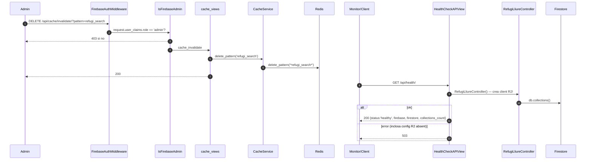

# Flux 11 — Endpoints admin de cache i health check

> **[FET]** comprovat al codi · **[INFERÈNCIA]** deducció · **[NO VERIFICAT]** depèn de config externa.

## Endpoints
| Mètode | URL | Vista | Permisos | Comportament |
|---|---|---|---|---|
| GET | `/api/cache/stats/` | `cache_stats` (`api/views/cache_views.py:51-63`) | IsFirebaseAdmin | `cache_service.get_stats()` (`api/services/cache_service.py:181-206`): Redis `INFO` + `DBSIZE` → `{connected, keys, memory_used, hits, misses}` |
| DELETE | `/api/cache/clear/` | `cache_clear` (L82-101) | IsFirebaseAdmin | `cache.clear()` |
| DELETE | `/api/cache/invalidate/?pattern=...` | `cache_invalidate` (L126-151) | IsFirebaseAdmin | `cache_service.delete_pattern(pattern)` → `*pattern*` |
| GET | `/api/health/` | `HealthCheckAPIView.get` (`api/views/health_check_views.py:52-80`) | públic (exclòs del middleware) | llista col·leccions arrel de Firestore |

Són les úniques vistes funció (`@api_view` + `@permission_classes`) del projecte **[FET]**.

## Diagrama

## Passos
- Fer-se admin, cURL i Swagger: [guides/admin-management.md](../guides/admin-management.md).
- Health: `RefugiLliureController.health_check` (`api/controllers/refugi_lliure_controller.py:102-127`) → `RefugiLliureDAO.health_check` (`api/daos/refugi_lliure_dao.py:229-243`).
- Ping extern: `.github/workflows/ping-website.yml` fa `curl` a `/swagger/` cada 9 minuts (no a `/api/health/`) per mantenir despert el servei de Render **[FET]**; el motiu (evitar l'*spin-down* del pla gratuït) és **[INFERÈNCIA]**.

## Errors
| Cas | HTTP |
|---|---|
| No admin | 403 |
| `pattern` absent | 400 |
| Error Redis a `stats` | **200** amb `{connected:false, error}` (el servei s'empassa l'excepció) |
| Error a `clear` | 500 |
| Health KO | 503 |

## Gotchas
- `cache.clear()` amb django-redis = `FLUSHDB` de tota la BD Redis, no només claus `refugis:*` **[INFERÈNCIA]**.
- `pattern='*'` és acceptat i ho esborra tot **[FET]**.
- El health check depèn de les variables R2 perquè el constructor del controller crea el client (`api/controllers/refugi_lliure_controller.py:22`, `api/r2_config.py:17-18`) i **no** comprova Redis **[FET]**.
